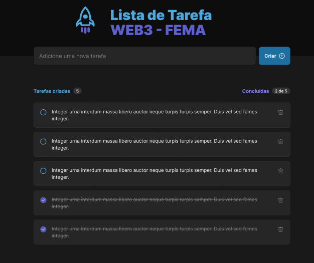

# FEMA - Peog. Web 3

## Lista de tarefas

### Layout proposta para a atividade: [Clicle Aqui](https://www.figma.com/file/5dwK9lTYEhwSR4A8ASccJC/ToDo-List-WEB3?type=design&node-id=0%3A1&mode=design&t=aueHITkodfaS439k-1)

#### A tarefa tem objetivo desenvolver uma lista de tarefas, onde o usuário pode adicionar, remover e marcar como concluída as tarefas



### Tecnologias utilizadas

- HTML
- CSS
- JavaScript
- ReactJS
- Styled Components

### Como rodar o projeto

```bash
# Clone o repositório
git clone

# Entre no diretório
cd todo-list

# Instale as dependências
npm install

# Rode o projeto
npm start
```
